# Projekat iz predmeta Praktikum - Internet i veb tehnologije - 2020/2021.
## Veb aplikacija za ponudu-potražnju privatnih časova
## Dušan Cvetnić 2017202297
## Projektni zahtev

Aplikacija treba da omogući nastavnicima koji drže privatne časove da se registruju, nakon čeka mogu da se prijave na aplikaciju. Nastavnik mora da unese svoje ime, prezime, jedinstvenu adresu elektronske pošte, da izabere jedan ili više gradova i mesta u kojima je spreman da drži nastavu, da uzabere jednu ili više oblasti iz koje drži privatne časove (Matematika, Programiranje, Biologija, Hemija, Sviranje gitare, Engleski jezik, Francuski jezik itd) i da uredi ostale elemente svog profila (lozinka, adresa e-pošte). U panelu za uređivanje ponude, stvara se lista sa spiskom oblast - mesto, npr. Matematika - Niš, Matematika - Vranje, gde nastavnik treba da unese cenu po času nastave za tu oblast i mesto, koja obuhvata cenu dolaska na kućnu adresu i držanja časa. Učenici moraju da se registruju kako bi mogli da pregledaju spisak oglasa. Oglasi nisu dostupni posetiocima, već samo prijavljenim korisnicima, tj. učenicima. Učenici mogu da vrše pretragu po oblastima, lokacijama i okvirima cene časa (cena časa od-do). Učenici mogu da ocene profesora ocenom od 1 do 5. Unetu ocenu mogu u bilo kom trenutku da promene. Na profilu nastavnika se prikazuje prosek svih unetih ocena, kao i broj ocena koje nastavnik ima.

## Tehnicka ogranicenja

Aplikacija mora da bude realizovana na Node.js platformi korišćenjem Express biblioteke. Aplikacija mora da bude podeljena u dve nezavisne celine: back-end veb servis (API) i front-end (GUI aplikacija). Sav kôd aplikacije treba da bude organizovan u dva Git spremišta u okviru istog korisničkog naloga za ovaj projekat.
Baza podataka mora da bude relaciona i treba koristiti MySQL ili MariaDB sistem za upravljanje bazama podataka (RDBMS) i u spremištu back-end dela aplikacije mora da bude dostupan SQL dump strukture baze podataka, eventualno sa inicijalnim podacima, potrebnim za demonstraciju rada projekta.
Back-end i front-end delovi projekta moraju da budi pisani na TypeScript jeziku, prevedeni TypeScript prevodiocem na adekvatan JavaScript. Back-end deo aplikacije, preveden na JavaScript iz izvornog TypeScript koda se pokreće kao Node.js aplikacija, a front-end deo se statički servira sa rute statičkih resursa back-end dela aplikacije i izvršava se na strani klijenta. Za postupak provere identiteta korisnika koji upućuje zahteve back-end delu aplikacije može da se koristi mehanizam sesija ili JWT (JSON Web Tokena), po slobodnom izboru.
Sav generisani HTML kôd koji proizvodi front-end deo aplikacije mora da bude 100% validan, tj. da prođe proveru W3C Validatorom (dopuštena su upozorenja - Warning, ali ne i greške - Error). Grafički korisnički interfejs se generiše na strani klijenta (client side rendering), korišćenjem React biblioteke, dok podatke doprema asinhrono iz back-end dela aplikacije (iz API-ja). Nije neophodno baviti se izradom posebnog dizajna grafičkog interfejsa aplikacije, već je moguće koristiti CSS biblioteke kao što je Bootstrap CSS biblioteka. Front-end deo aplikacije treba da bude realizovan tako da se prilagođava različitim veličinama ekrana (responsive design).
Potrebno je obezbediti proveru podataka koji se od korisnika iz front-end dela upućuju back-end delu aplikacije. Moguća su tri sloja zaštite i to: (1) JavaScript validacija vrednosti na front-end-u; (2) Provera korišćenjem adekvatnih testova ili regularnih izraza na strani servera u back-end-u (moguće je i korišćenjem izričitih šema - Schema za validaciju ili drugim pristupima) i (3) provera na nivou baze podataka korišćenjem okidača nad samim tabelama baze podataka.
Neophodno je napisati prateću projektnu dokumentaciju o izradi aplikacije koja sadrži (1) model baze podataka sa detaljnim opisom svih tabela, njihovih polja i relacija; (2) dijagram baze podataka; (3) dijagram organizacije delova sistema, gde se vidi veza između baze, back-end, front-end i korisnika sa opisom smera kretanja informacija; (4) popis svih aktivnosti koje su podržane kroz aplikaciju za sve uloge korisnika aplikacije prikazane u obliku Use-Case dijagrama; kao i (5) sve ostale elemente dokumentacije predviđene uputstvom za izradu dokumentacije po ISO standardu.
Izrada oba dela aplikacije (projekata) i promene kodova datoteka tih projekata moraju da bude praćene korišćenjem alata za verziranje koda Git, a kompletan kôd aplikacije bude dostupan na javnom Git spremištu, npr. na besplatnim GitHub ili Bitbucket servisima, jedno spremište za back-end projekat i jedno za front-end projekat. Ne može ceo projekat da bude otpremljen u samo nekoliko masovnih Git commit-a, već mora da bude pokazano da je projekat realizovan u kontinuitetu, da su korišćene grane (branching), da je bilo paralelnog rada u više grana koje su spojene (merging) sa ili bez konflikata (conflict resolution).
# Razrada projektne dokumentacije
## Sadržaj

1. Uvod
    * Cilj razvoja
    * Obim sistema
    * Prikaz proizvoda
    * Funkcije proizvoda
    * Karakteristike korisnika
    * Ograničenja
2. Specifikacije zahteva
    * Spoljašnji interfejs
    * Zahtevi baze podataka

# Uvod

## Cilj razvoja aplikacije
Aplikacija je razvijana sa ciljem da se reši problem lake komunikacije izmešu studenata koji potražuju privatne časove i profesora koji takve usluge pružaju. Profesori će na jednostavan način moći da se registruju i okače oglase za držanje privatnih časova, dok će sa druge strane učenici moći lako da pronađu predmete iz kojih su im potrebni privatni časovi.
## Obim sistema
Aplikacija se po pravilu hostuje na veb serveru i pristupa joj se preko unošenja odgovarajuće adrese u veb pregledač. Potrebno je takođe da postoji i server baze podataka na kome će biti smeštena celokupna baza koja je neophodna za rad aplikacije. Korisnici mogu pristupiti aplikaciji isključivo putem interneta, a na isti način se vrši i komunikacija između baze podataka i veb servera.
## Prikaz proizvoda
### Funkcionalni zahtevi aplikacije su:    
* na samom početku ukoliko korisnik nema nalog - registracija korisnika
* prijava korisnika kojom se utvrđuje identitet korisnika i dozvoljava pristup aplikaciji
* ukoliko je korisnik profesor dobija mogućnost da može da uređuje svoje oglase za privatne časove, da ih ažurira ili briše
* ukoliko je korisnik student dobija mogućnost da pregleda oglase, ocenjuje profesora
* svi korisnici mogu da uređuju svoje profile
### Nefunkcionalni zahtevi aplikacije su:
* Potrebno je da aplikacija bude aktivna na veb serveru koji će na brz način moći da odgovori na potrebe klijenata
* aplikacija prestaje da radi isključivo usled nestanka struje ili problemu na serveru
* svi podaci koji dolaze u bazu podataka se validiraju kako na delu korisničkog interfejsa tako i u pozadinskoj logici i ne može se dogoditi da korisnik utiče na rad same aplikacije

## Funkcije proizvoda

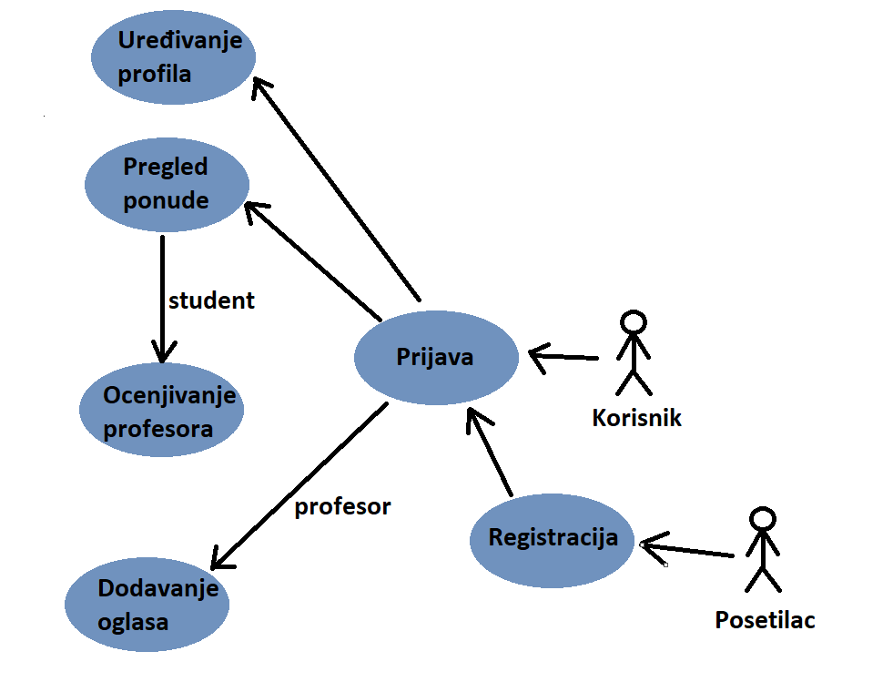

- Na slici su prikazani slucajevi koriscenja aplikacije.
- Na samom pocetku korisnik koji je u tom trenutku samo posetilac nema uvid u sadrzaj aplikacije i mora da se registruje kako bi pregledao oglase. Nakon registracije korisnik se upucuje na prijavu kako bi se potvrdio njegov identitet i dodelila odgovarajuca prava.
- Korisnik se registruje sa svojim imenom, prezimenom, email adresom, unosenjem lozinke i biranjem opcija da li zeli da se registruje kao profesor ili kao student.
- Korisnik se prijavljuje putem svoje email adrese i passworda i nakon prijave odredjuje mu se tip u zavisnosti kako je stavio u registraciji
- Postoji dva tipa korisnika: profesor i student
- Profesor nakon registracije i prijave dobija mogucnost da postavlja oglase za drzanje privatnih casova
- Student nakon registracije i prijave dobija mogucnost da pretrazuje ponudjene oglase ya privatne casove i da ocenjuje profesore.
- Svi korisnici imaju mogucnost da azuriraju svoje profile, a na profilima profesora se pored osnovnih korisnickih podataka nalazi i prosecna ocena 

## Karakteristike korisnika

Korisnik mora da ima mogucnost da pristupi internetu kako bi koristio aplikaciju, kao i da ima iskustva u radu sa slicnim aplikacijama kako bi se sto pre navikao na koriscenje.

## Spoljasnji interfejs

prva stvar koju korisnik vidi na pocetku pokretanja aplikacije je forma za prijavu

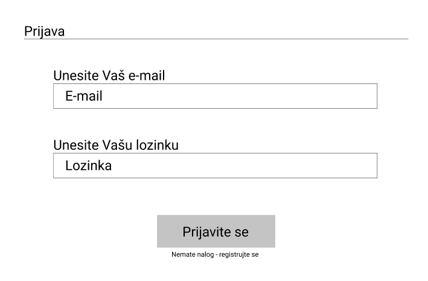

ukoliko korisnik nema nalog moze klikom na link registrujte preci na formu za registraciju:

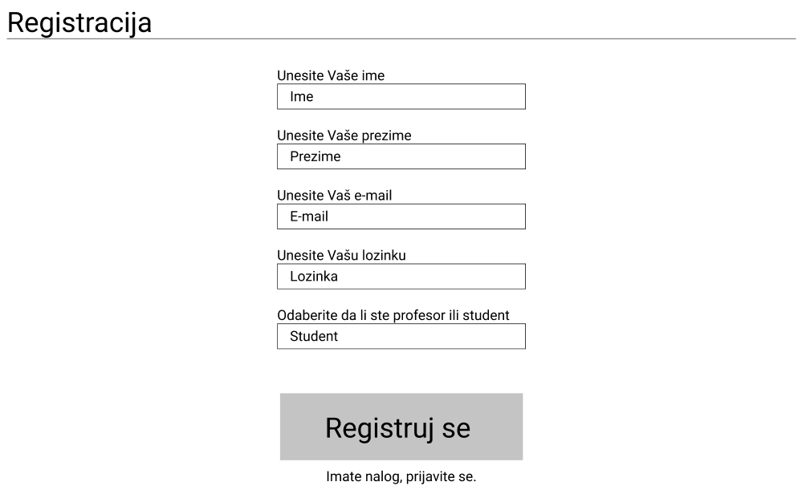

Nakon toga korisnik se preusmerava na stranicu sa spiskom ponuda privatnih casova:

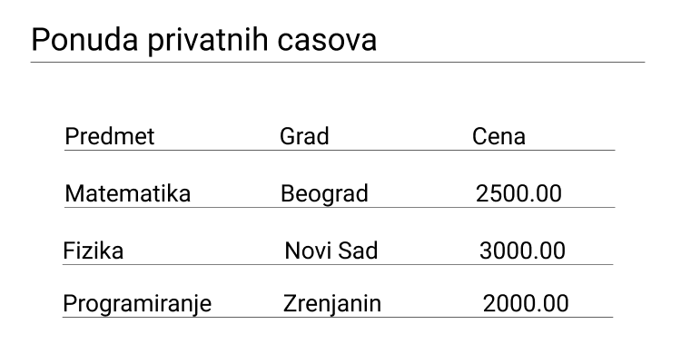

Klikom na ponudu on moze detaljnije pogledati kao i uci na profil profesora i pogledati njegovu ocenu.

## Zahtevi baze podataka

Na sledecoj slici je prikazan model baze podataka:

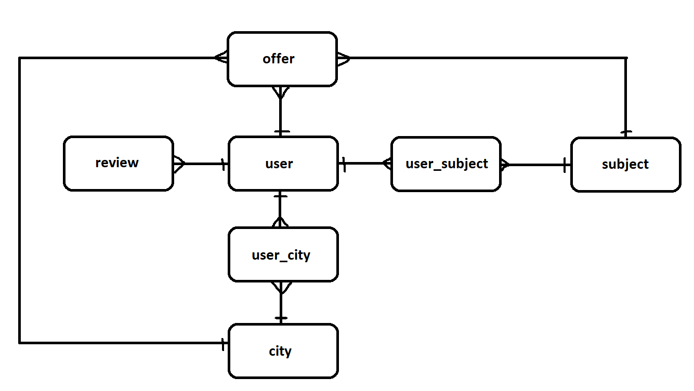

## Tabela user:

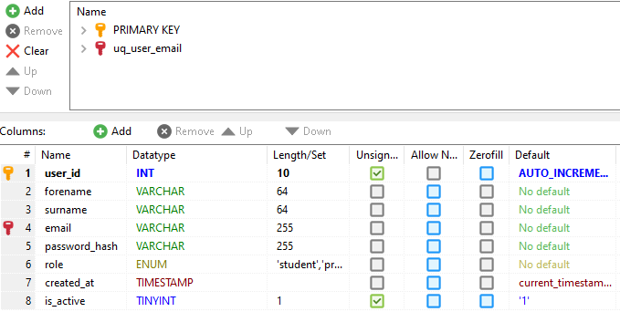

## Tabela offer:

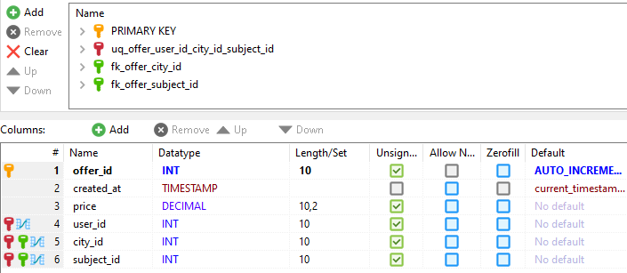

## Tabela review:

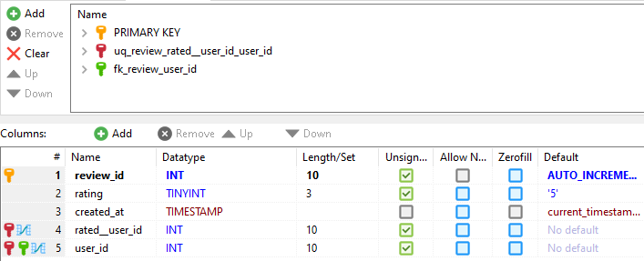

## Tabela city:

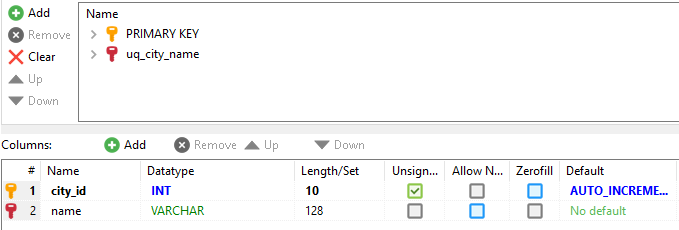

## Tabela subject:

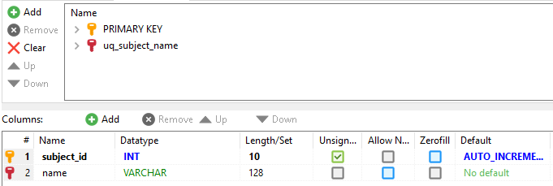

## Tabela user_subject:

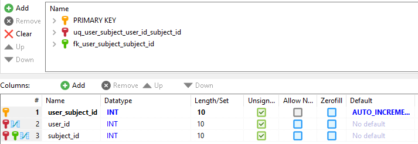

## Tabela user_city:

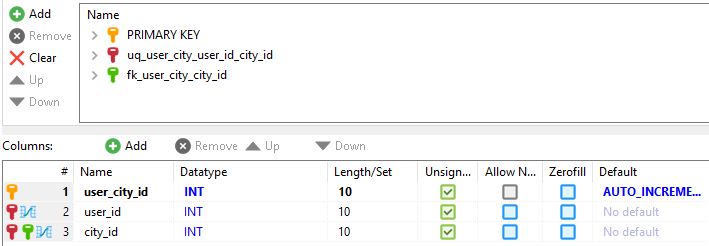